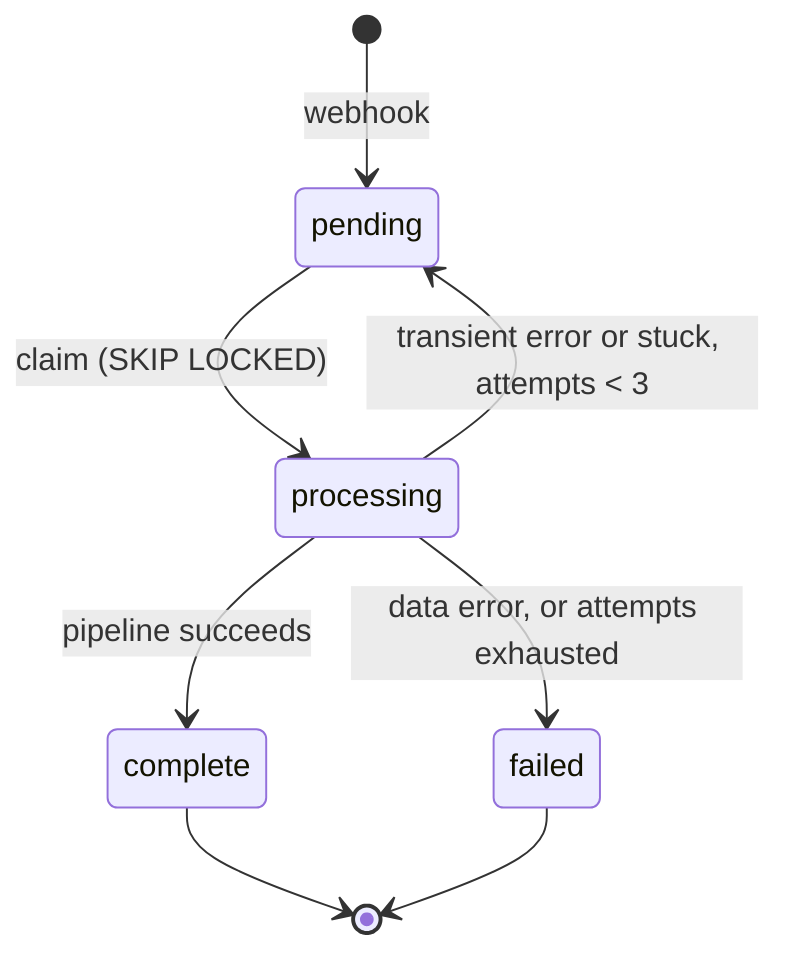

# Architecture

This document describes the high-level architecture of Archie.

## Bird's Eye View

Archie transcribes and analyzes recorded calls using the OpenAI APIs — Whisper for
transcription and GPT-4o-mini for analysis.

Calls arrive at the API via webhook. That request is where the process starts: the call is
stamped `pending` and persisted to Postgres. Transcription and analysis happen later, outside
the request path.

## Call status

`status` is a column on the call record. It represents the state a call is currently in, and
it is the central concept in the system. There are four values:

| Status       | Meaning                                                          |
| ------------ | ---------------------------------------------------------------- |
| `pending`    | Waiting to be processed                                          |
| `processing` | Currently moving through the transcription and analysis pipeline |
| `complete`   | Successfully finished the pipeline                               |
| `failed`     | Could not be processed, after max retry attempts                 |

## Lifecycle

A **claim worker** moves calls through the lifecycle. It runs intermittently and, on each run,
claims a `pending` record using Postgres `SKIP LOCKED`, which guarantees that no two workers
claim the same record. The claim stamps the record `processing`, increments `attempts` and
timestamps `processing_started_at` — all at the moment of the claim.

From there:

1. Fetch and download the audio file from the `audioUrl` supplied in the original payload.
2. Run the call through the transcriber, then the analyzer, via OpenAI.

If no error occurs, the record is marked `complete` and its data is persisted to Postgres.

## Retries

Retries exist for **transient errors** — network failures and the like. A data error is not
retried; it goes straight to `failed`.

The pipeline draws that boundary itself. Each stage decides how the errors it raises should be
treated, rather than a central rule trying to infer intent from an error value after the fact.

Two situations trigger a retry:

1. **Stuck** — the call has been in `processing` too long, defined as
   `now() - processing_started_at > threshold`. The worker sweeps for these on each run, since
   a process that died cannot report its own failure.
2. **Explicit transient error** — the pipeline returned a network error.

Both are handled more or less the same way. The record is marked with `last_error` (the error
message, or `stuck threshold exceeded` for the stuck case) and `next_attempt_at` (when to retry
next).

Each record is allowed 3 attempts. An attempt only takes place once `next_attempt_at` has been
reached, and each additional attempt pushes `next_attempt_at` further out as a backoff: 10 and
20 minutes.

Once max attempts are reached, the record is marked `failed`.

## Code Maps

todo
